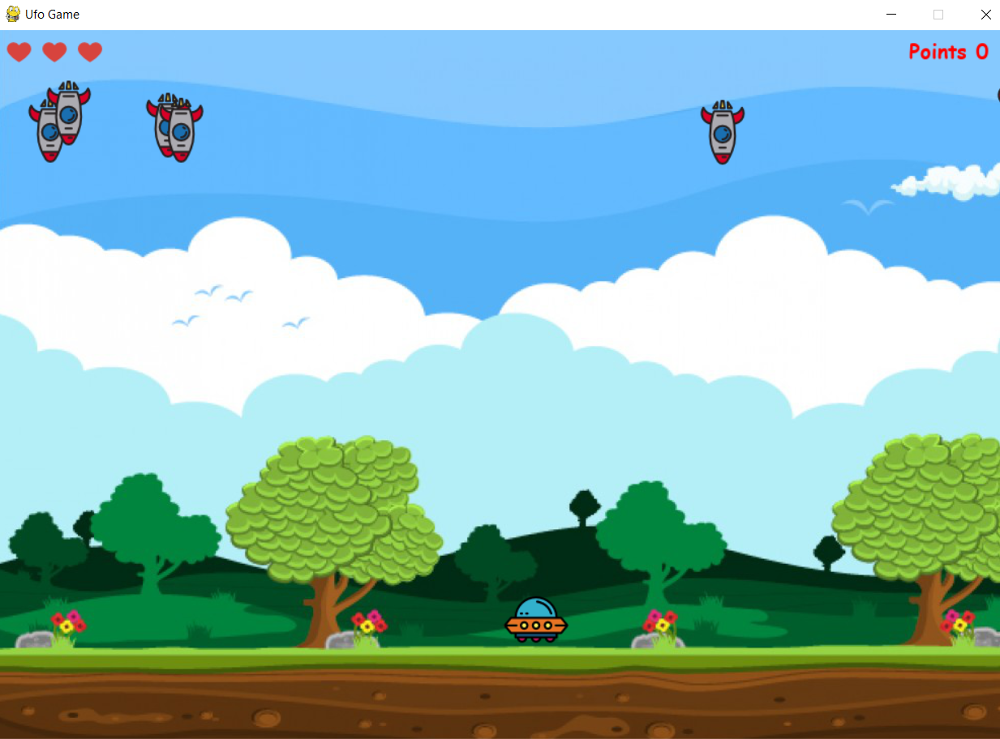

# Ufo Game

This is inspired by Meth-Meth-Method's [ufo game] (https://github.com/stefaniavallone/ufo-game.git)

## Running

* $ pip install -r requirements.txt
* $ python src/main.py

## Controls

* Left: Move left  
* Right: Move right  
* Space: Pause  
* Space: Restart

## Current state:

## Dependencies	
* pygame	

## Contribution

If you have any Improvements/Ideas/Refactors feel free to contact me or make a Pull Request.
The code needs still alot of refactoring as it is right now, so I appreciate any kind of Contribution.
